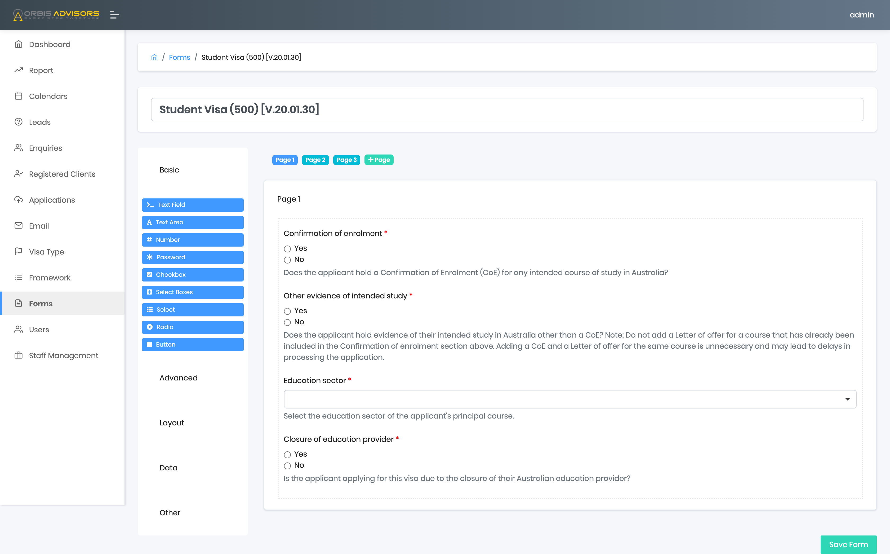

# Immigration Advisor Customer Relationship Management

# Introduction

This is a CRM system built for an immigration advisor company in Australia. 
Based on the contract, we are not allowed to maintain the source code, this project only contains the user manual

# Core Features

## Form Builder
Build customized forms for each kind of enquiry.

## Calendar
Managing appointments with customers and upcoming events - integrated with Google Calendar.

## Business Report
Statistics on the business status, including financial data.

## Progress Tracking
Customers can track their application status (updated by agents).

## Custom Email Templates
Send email filled automatically with customer's info in seconds.

## Users Management
Managing customers and working staffs

## Notes & Reminders
Taking notes and creating reminders for specific customers/applications.

## To-do List
Creating to-do tasks with priority level and due date

## File Management
Manage customers' files and creating new folder for customer from template in seconds.

## Invoices Management
Import and link invoices from Xero to the customers.

# Other Screenshots

